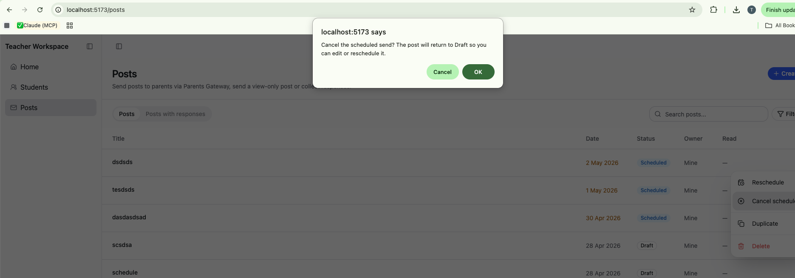

# Design TODOs

Running list of UX/visual polish items deferred from feature work — typically
because the underlying behaviour landed first and the pixel work belongs to
design review. Each entry should be picked up by design (`@reza`) and either
shipped, deferred, or closed as won't-do.

## Open

### Cancel-send confirm dialog

**Where:** [web/containers/PostsView.tsx:272-276](../../web/containers/PostsView.tsx#L272-L276) — `handleCancelSchedule`

**Today:** native `window.confirm()` — bare browser dialog, breaks the rest
of the styled modals (delete, schedule picker, send confirmation).

**Reference:** PGW shows a styled modal:

- Title: "Cancel sending this post?"
- Body: "You're about to cancel send the scheduled announcement '<title>'. Once cancelled, the post will be moved to Drafts, where you can edit or delete it."
- Primary action: "Cancel send"
- Secondary action: "No, not now"

**Suggested approach:** copy `DeletePostDialog` ([web/components/posts/DeletePostDialog.tsx](../../web/components/posts/DeletePostDialog.tsx)) into a new `CancelSchedulePostDialog`, swap copy + button labels, wire it up the same way the delete dialog is mounted in `PostsView`.
