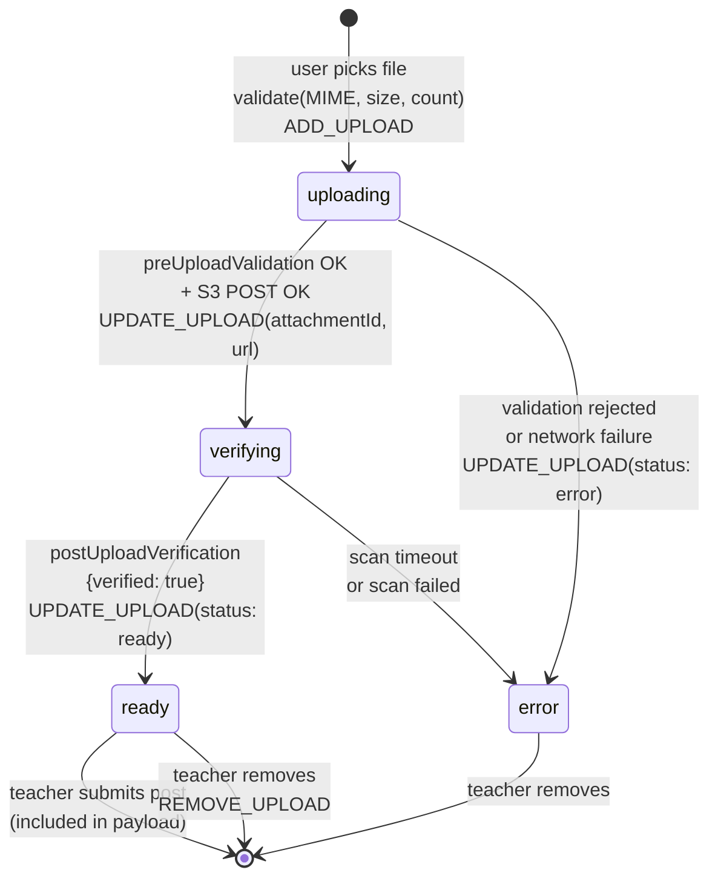

# feat: File & photo attachments on post create/edit

## Overview

The `AttachmentSection` on the post create/edit form (`web/components/posts/AttachmentSection.tsx:1-28`) is a static placeholder today — heading, "Files 0/3", copy, and a **disabled** "Add files" button. Teachers can't actually attach anything. Image #15 reviewer feedback asks us to make it real.

We'll ship a working end-to-end file and photo upload flow that runs against the mock BFF immediately, and flips to real PGW once pgw-web implements the endpoints. Both files and photos cap at **3 items, 5 MB each**. Files go to `attachments` in the write payload; photos go to `images` (with one flagged as cover).

## Problem Frame

Attachments are the #1 missing capability on the Posts surface per `docs/audits/pg-fe-may-testing.md:35`. Teachers routinely need to attach permission slips, event schedules, and rosters to posts — today they paste links into the description as a workaround, which misses PG's attachment viewer and download tracking.

The PGW contract documents a 3-step upload flow (`docs/references/pg-api-contract.md:1235-1266`):

1. `POST /api/files/2/preUploadValidation` (multipart) → `{ attachmentId, presignedUrl, fields }`
2. Client `POST` to the S3 presigned URL with the file
3. `GET /api/files/2/postUploadVerification?attachmentId=…` → `{ verified: true }` (AV-scan gate)

Once all uploads are verified, their `attachmentId`s land in the announcement/consent-form POST as `attachments: PGApiAttachment[]` (files) or `images: PGApiImage[]` (photos).

**Known pgw-web gap** (`docs/audits/pg-backend-contract.md:166`): these endpoints are documented in the contract but **not implemented in pgw-web yet**. Mock stubs exist in `server/internal/pg/mock.go:332-335` but return incomplete responses (no `presignedUrl`). We build the full client pipeline against the contract now, extend the mock so dev round-trips end-to-end, and flip to real PGW the moment it ships — zero client-code change needed.

## Requirements Trace

- **R1.** Replace the disabled "Add files" placeholder with a functional picker that accepts up to 3 files (≤ 5 MB each) with a PDF / Office-doc MIME allowlist.
- **R2.** Same affordance for photos: up to 3 (≤ 5 MB each), JPEG / PNG / WebP allowlist, exactly one flagged as cover.
- **R3.** End-to-end upload pipeline matching PGW's 3-step contract (`preUploadValidation` → S3 POST → `postUploadVerification`), surfacing per-item status (`Uploading…` / `Scanning…` / `Ready` / `Failed`).
- **R4.** Form submit is blocked while any item is mid-upload; verified items are included in the POST payload (files → `attachments`, photos → `images`).
- **R5.** Edit mode rehydrates previously uploaded items from the announcement detail endpoint.
- **R6.** Mock BFF (`TW_PG_MOCK=true`) round-trips the full flow in dev with no external S3; real PGW cutover is a base-URL swap.
- **R7.** Validation errors (size, MIME, count) surface via `notify.error` toasts without blocking subsequent uploads.

## Scope Boundaries

- Files: PDF + Word + Excel + PowerPoint MIME allowlist. No audio, video, or archives in this round.
- Photos: JPEG / PNG / WebP only. No HEIC or GIF.
- Cover-photo concept is a single-select radio — no drag-and-drop reordering.

### Deferred to Separate Tasks

- **Real PGW upload path** — awaits pgw-web shipping `/api/files/2/preUploadValidation` + `/postUploadVerification`. Tracked in `## TODO — Real PGW + S3 cutover` below. Client code is forward-compatible; only the BFF needs to change.
- **Consent-form file rehydration on edit** — awaits PGW exposing `attachments` on `PGApiConsentFormDetail` (currently carries `images` only). Photos on consent forms rehydrate (already in contract). Files on consent forms can be added on create/edit but won't re-appear on reload — flag with a non-blocking toast during Unit 7.
- **30-day draft file expiry banner** (`docs/ideation/2026-04-20-posts-pg-parity-ideation.md:134`) — once uploads are in, teachers loading a draft need a "files expire in N days" notice. Separate slice.
- **Drag-and-drop upload zone** — click-to-pick ships in this plan. DnD is a polish follow-up.
- **Thumbnail generation for non-image files** — PDF/Office files show a file-type icon. PGW's thumbnailUrl isn't populated on these.

## Context & Research

### Relevant Code and Patterns

- `web/components/posts/AttachmentSection.tsx:1-28` — current static placeholder. Full rewrite target.
- `web/components/posts/WebsiteLinksSection.tsx:1-60` — ergonomic reference for "array-managed section with max count, add/remove actions dispatched upward". `MAX_WEBSITE_LINKS = 3` pattern mirrors what we need for `MAX_ITEMS = 3`.
- `web/containers/CreatePostView.tsx:152-242` — `PostFormState`, `PostFormAction`, `INITIAL_STATE`, `formReducer`. New slots and action branches land here.
- `web/containers/CreatePostView.tsx:961` — current render site for `<AttachmentSection />` inside the CONTENT card.
- `web/api/client.ts:136-154` — `mutateApi` JSON POST helper. Does not handle multipart; we'll add a `postMultipart` sibling.
- `web/api/client.ts:118-134` — `fetchApi` / `fetchApiRoot`. `fetchApiRoot` is the prefix model for hitting `/api/files/*` (outside the `/api/web/2/staff` base).
- `web/api/mappers.ts:271-340` — `mapConsentFormDetail`. `mapAnnouncementDetail` is where file rehydration attaches.
- `server/internal/pg/mock.go:329-337` — `registerMockFiles`. Replace incomplete stubs.
- `server/internal/pg/mock.go:348-374` — `serveFixture` / `jsonStub` / `noContent` helpers. We'll write the new handlers inline (multipart parsing + stateful attachmentId counter need real Go, not a `jsonStub`).
- `web/lib/notify.ts` — toast helper for validation errors. Already imported in `CreatePostView`.
- `web/api/errors.ts` — `PGError` hierarchy for network-failure handling. Existing `handleErrorResponse` pattern.

### Institutional Learnings

- `docs/audits/pg-backend-contract.md:166` — pgw-web does not implement the `/api/files/2/*` endpoints. Prior assumption was wrong; plan accordingly.
- `docs/audits/pg-fe-may-testing.md:35` — attachments are flagged as the top blocker for "full confidence" testing. Prior recommendation: build the pipeline against the contract and defer S3.
- `docs/ideation/2026-04-20-posts-pg-parity-ideation.md:134-136` — rationale for a single file pipeline serving both announcements and consent forms.
- `docs/brainstorms/2026-04-20-posts-creation-consent-form-parity-requirements.md:52` — attachments explicitly split out of consent-form parity pending backend confirmation. This plan is that follow-up slice.

### External References

- MDN: [Uploading files with FormData](https://developer.mozilla.org/en-US/docs/Web/API/FormData) — matches the `multipart/form-data` body shape PG's `preUploadValidation` expects.
- AWS S3 POST policy (presigned POST) — the `fields` object PG returns is a standard S3 POST policy; client must submit all fields alongside the file in the same multipart request.

## Key Technical Decisions

- **Build against the documented PGW contract even though pgw-web hasn't implemented it.** The client pipeline is forward-compatible — when PG ships, it works unchanged. Mock fills the dev-time gap (see Unit 1). Rationale: holding the frontend would strand teachers on the placeholder; mocking lets us ship teacher-visible progress and catch UX edges early.
- **Mock's "S3" is a local BFF route, not a real bucket.** `preUploadValidation` returns `presignedUrl: "/api/files/2/mockUpload?attachmentId=…"` pointing to a new `POST /api/files/2/mockUpload` handler on the same Go BFF that 204s the body. No AWS creds, no Localstack, no sidecar. Cutover to real PGW only changes what PG returns as `presignedUrl` — client logic is identical.
- **Two slots in form state, one shared shape.** `state.attachments: UploadingFile[]` (files) + `state.photos: UploadingFile[]`. The only differences between files and photos are MIME allowlist, write-payload destination, and cover flag — cheaper to share one reducer + one component than to duplicate.
- **Status as a union, not a boolean pair.** `status: 'uploading' | 'verifying' | 'ready' | 'error'` keeps state machine transitions explicit and makes the submit guard a one-liner (`items.every(i => i.status === 'ready')`).
- **`localId` (UUID) distinct from `attachmentId` (server int).** The item exists in React state before the server gives it an ID; using the server ID as React key would break the `key` during the uploading phase. The reducer always keys by `localId`.
- **Cover is always defined when ≥ 1 photo exists.** Reducer invariant: the first photo added gets `isCover: true`; if the cover is removed, the first remaining photo inherits. Eliminates "no cover selected" edge cases on submit.

## Open Questions

### Resolved During Planning

- **Scope: full pipeline vs UI-only?** Full pipeline + realistic mock. Rationale: forward-compat with real PGW, no second pass needed when PG ships.
- **Photos max count?** 3, not 12 as the stale placeholder showed (per PG). Placeholder copy was wrong.
- **Cover-photo UX?** Radio on each photo row; exactly one selected at a time. First photo auto-covers on first upload.

### Deferred to Implementation

- **Retry-on-timeout behavior for `postUploadVerification`.** The real PG antivirus scan takes variable time. Plan: poll with linear backoff, give up after ~30s, mark `status: 'error'` with a "Scan timed out" message. Exact backoff tuning is an implementation detail.
- **Abort handling when teacher navigates away mid-upload.** Probably just let the fetch resolve or error naturally — form state is destroyed with the unmount. Revisit if it causes orphaned PG records.
- **Exact Go multipart handler shape.** The mock needs to parse multipart to get the file name/size for the response. Standard-library `r.ParseMultipartForm` is sufficient; verify during Unit 1.
- **Existing fixtures for edit-mode rehydration.** `announcement_detail.json` fixtures may or may not already include `attachments` / `images` entries. If empty, add one or two to each to make Unit 7 exercisable.

## High-Level Technical Design

> _This illustrates the intended upload state machine and is directional guidance for review, not implementation specification. The implementing agent should treat it as context, not code to reproduce._



**Reducer contract (directional, not literal code):**

```
UploadingFile {
  localId: UUID              // stable React key
  kind: 'file' | 'photo'     // routes to attachments vs images slot
  name, size, mimeType       // from the picked File object
  status: 'uploading' | 'verifying' | 'ready' | 'error'
  attachmentId?: number      // from preUploadValidation
  url?: string               // populated after S3 POST
  thumbnailUrl?: string      // photos only
  isCover?: boolean          // photos only; exactly one true when photos.length >= 1
  error?: string             // populated on status === 'error'
}

Actions:
  ADD_UPLOAD         { kind, localId, name, size, mimeType }
  UPDATE_UPLOAD      { localId, patch: Partial<UploadingFile> }
  REMOVE_UPLOAD      { localId }   // if removed item was cover photo, reassign to first remaining
  SET_COVER_PHOTO    { localId }   // unset isCover on all others
```

## Implementation Units

- [ ] **Unit 1: Mock BFF — usable `/api/files/2/*` endpoints**

**Goal:** Replace the incomplete `jsonStub` handlers with handlers that actually round-trip a file upload end-to-end in `TW_PG_MOCK=true`.

**Requirements:** R6

**Dependencies:** None

**Files:**

- Modify: `server/internal/pg/mock.go`
- Test: `server/internal/pg/mock_files_test.go` (new)

**Approach:**

- Replace `server/internal/pg/mock.go:332-335` `registerMockFiles`:
  - `POST /api/files/2/preUploadValidation` — parse multipart form (`r.ParseMultipartForm(6<<20)`), read the `file` / `type` / `mimeType` / `fileSize` fields, return `{ "attachmentId": <incr>, "presignedUrl": "/api/files/2/mockUpload?attachmentId=<n>", "fields": {} }`.
  - `POST /api/files/2/mockUpload` — new route; read the body (or don't — no need to retain it) and return `204`.
  - `GET /api/files/2/postUploadVerification?attachmentId=…` — return `{ "verified": true }` unconditionally.
  - Keep `handleDownloadAttachment`, `scanResult`, `handleResizeImageNotFound` as-is.
- Use a package-level `atomic.Int64` counter seeded at `10000` so mock IDs don't collide with fixture data (PG fixtures use IDs in the 1000s).
- Route registration stays in the `registerMockFiles` function (matches sibling modules).

**Patterns to follow:**

- `server/internal/pg/mock.go:363-370` — `jsonStub` helper for the simple cases.
- `server/internal/pg/mock.go:57-64` — pattern-matched handler using `r.PathValue` + closure. Use this idiom for the multipart case.

**Test scenarios:**

- Happy path: POST multipart to `/api/files/2/preUploadValidation` with a small PDF → 200 with `attachmentId > 0`, `presignedUrl` matching `/api/files/2/mockUpload?attachmentId=<that-id>`, `fields` as an object.
- Happy path: POST to the returned `presignedUrl` with any body → 204.
- Happy path: GET `/api/files/2/postUploadVerification?attachmentId=<any>` → 200 `{"verified":true}`.
- Integration: two sequential preUpload calls return monotonically increasing `attachmentId`s (no collisions).
- Edge case: preUpload with missing `file` part → still returns a usable response (mock is permissive, since tightening it would diverge from real PG error codes that are undocumented).

**Verification:**

- `curl -F file=@/tmp/x.pdf -F type=ANNOUNCEMENT -F mimeType=application/pdf -F fileSize=1234 http://localhost:3000/api/files/2/preUploadValidation` returns a valid JSON with `attachmentId` + `presignedUrl`.
- `go test ./server/internal/pg -run TestMockFiles` passes.

---

- [ ] **Unit 2: Validation helpers — `web/helpers/attachments.ts`**

**Goal:** Single source of truth for file/photo limits, MIME allowlists, and validation checks.

**Requirements:** R1, R2, R7

**Dependencies:** None

**Files:**

- Create: `web/helpers/attachments.ts`
- Create: `web/helpers/__tests__/attachments.test.ts`

**Approach:**

- Export: `MAX_ITEMS = 3`, `MAX_FILE_SIZE_BYTES = 5 * 1024 * 1024`.
- Export: `ALLOWED_FILE_MIME` (tuple) — `application/pdf`, `application/msword`, `application/vnd.openxmlformats-officedocument.wordprocessingml.document`, `application/vnd.ms-excel`, `application/vnd.openxmlformats-officedocument.spreadsheetml.sheet`, `application/vnd.ms-powerpoint`, `application/vnd.openxmlformats-officedocument.presentationml.presentation`.
- Export: `ALLOWED_PHOTO_MIME` — `image/jpeg`, `image/png`, `image/webp`.
- Export: `validateUploadFile(file: File, kind: 'file' | 'photo', existingCount: number): { ok: true } | { ok: false; reason: string }`. Order checks so the most specific rejection wins: count → size → MIME.
- Export: `formatFileSize(bytes: number): string` — `"1.2 MB"` / `"340 KB"` style.

**Execution note:** Test-first. Pure-function helpers with well-defined cases — unit tests are trivially cheaper than debugging the UI.

**Patterns to follow:**

- `web/lib/validation-errors.ts` — function-returning-discriminated-union pattern.
- `web/helpers/dateTime.ts` — small pure-function helper module layout.

**Test scenarios:**

- Happy path: valid PDF under 5 MB with count 0 → `{ ok: true }`.
- Happy path: valid PNG under 5 MB with count 0, kind `'photo'` → `{ ok: true }`.
- Edge case: file exactly at 5 MB → accepted (boundary is `<=`).
- Edge case: file at 5 MB + 1 byte → rejected with size message.
- Edge case: `existingCount === MAX_ITEMS` → rejected with count message (count check runs before size/MIME).
- Error path: `.exe` MIME type → rejected with "Unsupported file type." reason.
- Error path: JPEG passed with `kind: 'file'` → rejected (photo MIME doesn't satisfy file allowlist).
- Error path: PDF passed with `kind: 'photo'` → rejected (file MIME doesn't satisfy photo allowlist).
- Happy path: `formatFileSize(1024)` → `"1.0 KB"`; `formatFileSize(1024 * 1024 * 2.5)` → `"2.5 MB"`; `formatFileSize(500)` → `"500 B"`.

**Verification:**

- `pnpm test web/helpers/__tests__/attachments.test.ts` passes.

---

- [ ] **Unit 3: Upload client — 3-step pipeline in `web/api/client.ts`**

**Goal:** Thin, forward-compatible wrapper around PG's documented upload contract.

**Requirements:** R3, R6

**Dependencies:** Unit 1 (mock must respond), Unit 2 (validation runs before upload is called)

**Files:**

- Modify: `web/api/client.ts`

**Approach:**

- Add a `postMultipart<T>(path: string, formData: FormData): Promise<T>` helper near `mutateApi`. Uses `fetchApiRoot` prefix convention (since `/api/files/*` is outside `/api/web/2/staff`). Delegates to `handleErrorResponse` and `unwrapEnvelope` identically.
- Add three exported functions:
  - `validateAttachmentUpload(file: File, type: 'ANNOUNCEMENT' | 'CONSENT_FORM'): Promise<{ attachmentId: number; presignedUrl: string; fields: Record<string, string> }>` — builds a `FormData` with `file`, `type`, `mimeType`, `fileSize`. POSTs to `/files/2/preUploadValidation`.
  - `uploadToPresignedUrl(presignedUrl: string, fields: Record<string, string>, file: File): Promise<void>` — builds a `FormData` with all `fields` first (AWS POST policy ordering matters for real S3), appends `file` last, POSTs to `presignedUrl`. Throws on non-2xx.
  - `verifyAttachmentUpload(attachmentId: number): Promise<{ verified: boolean }>` — GET `/files/2/postUploadVerification?attachmentId=<n>`.
- Export a composed `uploadAttachment(file, type, onProgress?: (status) => void): Promise<{ attachmentId, url, thumbnailUrl? }>` that runs the three calls in sequence with a poll-with-backoff on `verifyAttachmentUpload` (retry every 500ms, cap at ~30s total), calling `onProgress('uploading' | 'verifying' | 'ready')` at boundaries. Returns the data needed to populate the form state.

**Patterns to follow:**

- `web/api/client.ts:136-154` — `mutateApi` error/envelope handling shape.
- `web/api/client.ts:70-116` — `handleErrorResponse`. Reuse, don't duplicate.

**Test scenarios:**

- None for the client functions directly — they're thin wrappers over `fetch` and would test the mock more than the code. Integration coverage via Unit 8's smoke test is sufficient.
- Exception: a unit test for the `uploadAttachment` composer covering **Integration: onProgress callback fires in `uploading → verifying → ready` order for the happy path**, and **Error path: verify polling gives up after the timeout and rejects**. Mock `fetch` via `vi.mock` for these two cases specifically.

**Verification:**

- Called from Unit 4's upload hook; the 3-step request sequence is visible in DevTools Network panel.

---

- [ ] **Unit 4: Form state — `attachments` and `photos` slots**

**Goal:** Reducer slots + actions + invariants for tracking in-flight and ready uploads.

**Requirements:** R3, R4

**Dependencies:** Unit 2 (types reference shared helpers)

**Files:**

- Modify: `web/containers/CreatePostView.tsx` (types, reducer, initial state, exported action type)
- Test: `web/containers/__tests__/CreatePostView.reducer.test.ts` (new file — isolates the reducer)

**Approach:**

- Add the `UploadingFile` interface (shape defined in High-Level Technical Design).
- Extend `PostFormState` (`web/containers/CreatePostView.tsx:154-199`): add `attachments: UploadingFile[]` and `photos: UploadingFile[]`.
- Extend `PostFormAction` (`web/containers/CreatePostView.tsx:201-220`):
  - `{ type: 'ADD_UPLOAD'; kind: 'file' | 'photo'; payload: Omit<UploadingFile, 'status' | 'kind'> & { kind: 'file' | 'photo' } }` (keep `kind` on payload so the reducer can route).
  - `{ type: 'UPDATE_UPLOAD'; kind: 'file' | 'photo'; localId: string; patch: Partial<UploadingFile> }`.
  - `{ type: 'REMOVE_UPLOAD'; kind: 'file' | 'photo'; localId: string }`.
  - `{ type: 'SET_COVER_PHOTO'; localId: string }`.
- `INITIAL_STATE` gets `attachments: []`, `photos: []`.
- Reducer cases:
  - `ADD_UPLOAD` — append with `status: 'uploading'`; for photos, if list was empty, set `isCover: true` on the new entry.
  - `UPDATE_UPLOAD` — map by `localId`, shallow-merge `patch`.
  - `REMOVE_UPLOAD` — filter out `localId`; if photo list and the removed entry was cover and ≥ 1 photo remains, mark the first remaining as cover.
  - `SET_COVER_PHOTO` — map photos, set `isCover = entry.localId === action.localId`.

**Execution note:** Test the reducer cases before wiring the UI. Cover reassignment is the subtle one — easy to get wrong, catastrophic if submit picks the wrong image.

**Patterns to follow:**

- `web/containers/CreatePostView.tsx:265-272` — existing `ADD_QUESTION` reducer case as a template for immutable append.
- `web/containers/CreatePostView.tsx:319-322` — existing `MOVE_QUESTION` for immutable array-by-index mutation.

**Test scenarios:**

- Happy path: `ADD_UPLOAD` kind `'file'` on empty list → one entry, `status: 'uploading'`, `isCover` undefined.
- Happy path: `ADD_UPLOAD` kind `'photo'` on empty list → one entry, `isCover: true`.
- Happy path: `ADD_UPLOAD` kind `'photo'` on list of 1 → new entry's `isCover: false`, existing entry unchanged.
- Happy path: `UPDATE_UPLOAD` patches merge (`{ status: 'verifying', attachmentId: 42 }`) without overwriting other fields.
- Happy path: `REMOVE_UPLOAD` drops matching `localId`.
- Edge case: removing the cover photo when 2 others remain → first remaining gets `isCover: true`.
- Edge case: removing the only photo → list empty, no cover reassignment needed (no panic).
- Edge case: `SET_COVER_PHOTO` on the already-cover photo → no-op (same state).
- Error path: `UPDATE_UPLOAD` with unknown `localId` → state unchanged (don't throw — reducer must remain pure).

**Verification:**

- `pnpm test CreatePostView.reducer` passes.
- `tsc --noEmit` passes with the new action types.

---

- [ ] **Unit 5: `AttachmentSection` rewrite — Files and Photos UI**

**Goal:** Functional upload affordance matching Image #15 for files, plus parallel photos sub-section.

**Requirements:** R1, R2, R7

**Dependencies:** Unit 2 (validation), Unit 3 (upload client), Unit 4 (reducer + action types)

**Files:**

- Modify: `web/components/posts/AttachmentSection.tsx` (full rewrite)

**Approach:**

- Component props: `{ files: UploadingFile[]; photos: UploadingFile[]; dispatch: Dispatch<PostFormAction>; kind: 'ANNOUNCEMENT' | 'CONSENT_FORM' }`.
- Internal hook `useUpload(kind: 'file' | 'photo', existing: UploadingFile[])` that:
  - Exposes `onPick(filesFromInput: FileList)` which, for each file, runs `validateUploadFile` → on ok, dispatches `ADD_UPLOAD` with a fresh `crypto.randomUUID()`, then kicks off `uploadAttachment` with an `onProgress` callback that dispatches `UPDATE_UPLOAD` at each state transition.
  - On validation failure: single `notify.error(reason)`; continues processing remaining files (teachers who pick 5 items where 2 are too big expect the 3 valid ones to still upload).
  - Caps acceptance at `MAX_ITEMS - existing.filter(ready-or-pending)` per pick action.
- Layout (two parallel sub-sections in one "Attachments" block matching Image #15):
  - **Files**: heading "Files {readyCount}/{MAX_ITEMS}", copy "Add up to {MAX_ITEMS} files, less than 5 MB each.", "Add files" button (`Paperclip` icon, `secondary` variant) → hidden `<input type="file" multiple accept="…pdf,.doc,.docx,.xls,.xlsx,.ppt,.pptx" />`.
  - **Photos**: heading "Photos {readyCount}/{MAX_ITEMS}" (corrected from the current stale `0/12`), copy "Add up to {MAX_ITEMS} photos, less than 5 MB each.", "Add photos" button (`Image` icon) → hidden `<input type="file" multiple accept="image/jpeg,image/png,image/webp" />`.
- Row rendering (shared sub-component `UploadRow`):
  - Left: thumbnail for photos (`` once `ready`, else gray icon), `FileText`/`Image` icon for files.
  - Middle: name, `formatFileSize(size)`, status chip. While `uploading` / `verifying`, show a small spinner alongside the status label. Errored rows show the message inline in destructive color.
  - Right (photos only): Cover radio. Clicking a non-cover photo dispatches `SET_COVER_PHOTO`.
  - Far right: `Trash2` remove button.
- Add/picker buttons disable when `readyCount + pendingCount >= MAX_ITEMS`.

**Patterns to follow:**

- `web/components/posts/WebsiteLinksSection.tsx:1-160` — array-managed section with dispatch prop, add/remove rows, max-count disable.
- `web/components/posts/DeletePostDialog.tsx` (new in sibling branch) — `destructive` variant usage for error state chip.
- `web/components/posts/SchedulePickerDialog.tsx` — hidden-input + button-triggered pattern (triggering click via ref).

**Test scenarios:**

- Integration: render `<AttachmentSection files={[]} photos={[]} />`, simulate file picker with a valid PDF → reducer receives `ADD_UPLOAD`, then (after upload client resolves) `UPDATE_UPLOAD` with `status: 'ready'`. Use `vi.mock` to stub `uploadAttachment`.
- Integration: render with 3 ready files → "Add files" button is disabled.
- Happy path: render with 2 photos (one cover) → cover photo's radio shows selected. Click the other photo's radio → `SET_COVER_PHOTO` dispatched.
- Error path: simulate file picker with a 10 MB PDF → no `ADD_UPLOAD` dispatched, `notify.error` called with size message.
- Error path: simulate a network failure during `uploadAttachment` → row transitions to `status: 'error'`, remove button still works.
- Edge case: picker returns 5 files but only 1 slot remains → 1 accepted, 4 rejected with count messages.

**Verification:**

- Component renders; picker flow works end-to-end against the mock.
- `pnpm lint` + `pnpm test` pass.

---

- [ ] **Unit 6: Wire into `CreatePostView` + submit guard**

**Goal:** Render the new `AttachmentSection` with the right props, and block submit while uploads are pending.

**Requirements:** R4

**Dependencies:** Units 4, 5

**Files:**

- Modify: `web/containers/CreatePostView.tsx` (render site + submit guard)
- Modify: `web/lib/createPostValidation.ts` (if submit validation lives there)

**Approach:**

- Replace `web/containers/CreatePostView.tsx:961` (`<AttachmentSection />`) with the full prop set:
  ```
  <AttachmentSection
    files={state.attachments}
    photos={state.photos}
    dispatch={dispatch}
    kind={state.kind === 'announcement' ? 'ANNOUNCEMENT' : 'CONSENT_FORM'}
  />
  ```
- Extend `isCreatePostFormValid(state)` (or the submit handler's preflight) with a guard: any `attachments[i].status !== 'ready'` or `photos[i].status !== 'ready'` → return false + surface `notify.error('Attachments still uploading.')` when user clicks Send anyway.
- Keep the existing schedule-draft path likewise guarded (same check).

**Patterns to follow:**

- `web/containers/CreatePostView.tsx` — wherever `isCreatePostFormValid` is currently consulted (see `handleSendConfirm` / `handleScheduleConfirm`).

**Test scenarios:**

- Test expectation: none for the prop-passing change — it's a wiring diff covered by Unit 5 integration.
- Integration: submit handler with one `status: 'uploading'` attachment → blocked, toast shown, no network call to `/announcements`.
- Happy path: submit handler with only `status: 'ready'` items → proceeds to `mutateApi`, verifies `attachments` array in body includes the uploaded entries' `attachmentId`s.

**Verification:**

- Manually start an upload, hit Send → blocked with toast. Once `Ready`, Send succeeds.

---

- [ ] **Unit 7: Mappers — submit payload + edit rehydration**

**Goal:** Carry uploaded items into the write payload; rehydrate existing items on edit.

**Requirements:** R4, R5

**Dependencies:** Unit 4

**Files:**

- Modify: `web/api/mappers.ts`

**Approach:**

- **Write side (`buildAnnouncementPayload`, `buildConsentFormPayload`):**
  - Files: `state.attachments.filter(a => a.status === 'ready').map(a => ({ attachmentId: a.attachmentId!, name: a.name, size: a.size, url: a.url! }))` → assigned to payload `attachments`.
  - Photos: `state.photos.filter(p => p.status === 'ready').map((p, i) => ({ imageId: p.attachmentId!, isCover: p.isCover ?? false, name: p.name, size: p.size, thumbnailUrl: p.thumbnailUrl ?? '', url: p.url! }))` → assigned to payload `images`. If no photo has `isCover: true` (should be impossible per reducer invariant but defensive), set the first one.
- **Read side (`mapAnnouncementDetail`):**
  - `detail.attachments` → push into `PGAnnouncementPost.attachments` as `UploadingFile[]` with `kind: 'file'`, `status: 'ready'`, copied fields.
  - `detail.images` → push into `PGAnnouncementPost.photos` as `UploadingFile[]` with `kind: 'photo'`, `status: 'ready'`, `thumbnailUrl` + `isCover` carried through.
- **Read side (`mapConsentFormDetail`):**
  - `detail.images` → same mapping as announcement.
  - `detail.attachments` — **field absent from contract**. Skip; add a one-line code comment pointing to the Deferred section of this plan.
- Extend `PGAnnouncementPost` / `PGConsentFormPost` interfaces in `web/data/mock-pg-announcements.ts` with `attachments: UploadingFile[]` and `photos: UploadingFile[]` (or reuse whatever type the form uses — consistent shape avoids a second mapping in Unit 6).

**Patterns to follow:**

- `web/api/mappers.ts:271-340` — `mapConsentFormDetail` structure. Existing `images` handling (if any) is the reference.
- `web/api/mappers.ts:442-544` — `buildConsentFormPayload` write-side shape.

**Test scenarios:**

- Happy path: form state with 2 `ready` files + 0 photos → write payload has `attachments.length === 2`, `images === undefined` (or `[]`).
- Happy path: form state with 1 `ready` photo flagged cover → payload has `images[0].isCover === true`.
- Happy path: mixed pending + ready items → only ready items in payload (pending filtered).
- Integration: round-trip a fixture announcement through `mapAnnouncementDetail` → resulting `PGAnnouncementPost.attachments` length matches fixture `attachments` length, all entries have `status: 'ready'`.
- Edge case: empty photos + non-empty files → no `images` in payload at all.
- Edge case: photos list exists but none has `isCover` (corrupt state) → first photo gets cover in payload (defensive fallback).

**Verification:**

- `pnpm test web/api/mappers` passes.
- Manual: edit an existing announcement with attachments → they appear as `Ready` rows on load.

---

- [ ] **Unit 8: End-to-end smoke + fixture updates**

**Goal:** Guarantee the happy path works against the mock BFF; make at least one fixture carry an attachment for edit-mode testing.

**Requirements:** R3, R5, R6

**Dependencies:** All prior units

**Files:**

- Modify: `server/internal/pg/fixtures/announcement_detail.json` (add 1 attachment + 1 image entry)
- Modify: `server/internal/pg/fixtures/announcement_detail_yes_no.json` (same, so the yes/no post also exercises edit rehydration)

**Approach:**

- Add realistic `attachments` and `images` entries to the fixtures so Unit 7's rehydration path isn't untested. Use plausible PG-shaped data — `attachmentId`, `name: "permission_slip.pdf"`, `size: 123456`, `url: "/api/files/2/handleDownloadAttachment?attachmentId=XXX"`. For images: add a `thumbnailUrl` pointing at the same mock endpoint, `isCover: true` on one.

**Test scenarios:**

- Manual smoke (documented below in Verification): the five-step flow round-trips.
- None automated — E2E Playwright doesn't exist in this repo yet, and Vitest can't drive the browser picker.

**Verification:**

- Walking the Verification checklist below produces the expected network traces and visible UI states.

## System-Wide Impact

- **Interaction graph:** `CreatePostView` → `AttachmentSection` (new wiring) → `useUpload` hook → `uploadAttachment` client → Go BFF. Submit path: `CreatePostView` → `buildAnnouncementPayload` / `buildConsentFormPayload` (modified) → `mutateApi` → BFF proxy → PGW.
- **Error propagation:** Validation errors surface as toasts and stay local. Network errors during upload mark the row `status: 'error'` and the submit guard naturally blocks until the teacher removes the errored row. PG validation errors (on submit of the parent post) continue to use the existing `handleErrorResponse` / `PGValidationError` path.
- **State lifecycle risks:** If a teacher removes an item mid-upload, the pending `fetch` calls complete after state is gone — no React warnings (no setState on unmount since the reducer dispatch is idempotent against removed rows). If a teacher navigates away mid-upload, the form state is destroyed and any in-flight S3 POST completes quietly. Orphaned PG `attachmentId`s that were never referenced are PG's concern.
- **API surface parity:** The upload pipeline is available to both announcement and consent-form creation paths. The write-side mappers route to the same PG slots (`attachments`, `images`).
- **Integration coverage:** Unit 5's integration test proves picker → reducer → dispatch; Unit 7's test proves read-side rehydration. Full round-trip via DevTools confirms the three-step mock flow.
- **Unchanged invariants:** `PostFormState.websiteLinks` / `shortcuts` / `questions` / `selectedRecipients` / etc. are untouched. Existing `mutateApi` / `fetchApi` helpers are not modified (only extended with a new `postMultipart`). The consent-form detail mapper's existing behavior on `images` is preserved.

## Risk Analysis & Mitigation

| Risk                                                                                                      | Likelihood | Impact                  | Mitigation                                                                                                                                                                                                         |
| --------------------------------------------------------------------------------------------------------- | ---------- | ----------------------- | ------------------------------------------------------------------------------------------------------------------------------------------------------------------------------------------------------------------ |
| PGW ships `/api/files/2/*` with different field names than the documented contract                        | Medium     | High (client-side swap) | Client wrapper (Unit 3) narrowly maps response fields. When PGW ships, sanity-check contract + patch `validateAttachmentUpload` response parsing. No UI code change.                                               |
| Teacher uploads file while antivirus scan is slow (> 30s) → row stuck in `verifying`                      | Medium     | Medium                  | Poll backoff + hard timeout in `uploadAttachment`; transitions to `error` with a "Scan timed out. Try again." message. Teacher can retry.                                                                          |
| Stale fixture attachments confuse edit-mode test (attachmentId collides with live mock counter)           | Low        | Low                     | Mock counter seeded at 10000; fixtures use IDs in the 1000s. No collision.                                                                                                                                         |
| S3 POST policy field order matters in real PGW, breaks silently on cutover                                | Low        | Medium                  | Unit 3's `uploadToPresignedUrl` appends `file` last after all `fields` (AWS POST policy requirement). Documented in code comment.                                                                                  |
| Photo thumbnails don't render because `thumbnailUrl` is server-generated, not client-known at upload time | Medium     | Low                     | Fall back to `url` (the full image) while thumbnail is unavailable. Real PGW populates `thumbnailUrl` asynchronously; defensive fallback keeps the UI correct.                                                     |
| Teacher submits with a `status: 'error'` row present                                                      | Low        | Low                     | Submit guard only blocks on `uploading` / `verifying`. Errored rows are ignored in the payload (filter on `status === 'ready'`). Teacher must remove the errored row to clean up the UI, but submit isn't blocked. |
| Large file picker action (e.g. selecting 10 files) freezes UI during validation                           | Low        | Medium                  | Validation is synchronous but cheap (no file read). Uploads run in parallel (Promise.all-ish via independent dispatches). Acceptable for max-3 cap.                                                                |

## TODO — Real PGW + S3 cutover

Tracked here so it's not buried in "Deferred". When pgw-web ships the real endpoints:

**PG contract verification (blocking on pgw-web):**

- [ ] Confirm real PGW response shape for `preUploadValidation` matches our client parsing (field names, case). Update if drift.
- [ ] Confirm real S3 presigned POST policy fields ordering requirement (`fields` before `file` is standard; verify).
- [ ] Confirm real `postUploadVerification` returns `{ verified: true }` vs `{ verified: true, ready: true }` or similar.
- [ ] **Confirm `PGApiAttachment.url` + `PGApiImage.thumbnailUrl` real-wire shapes.** Client currently synthesises `/api/files/2/handleDownloadAttachment?attachmentId=N` for mock round-trip. Real PG may return verbatim S3 / CDN URLs — if so, parent-app click-through still works; if PG itself generates these local-ish URLs on read, our synthesis is correct. Verify on staging. _(code-review #6)_
- [ ] **Confirm `postUploadVerification` terminal semantics.** Does `{ verified: false }` mean "still scanning, keep polling" or "AV rejected, stop"? Our client polls until `true` or 30s timeout — if PG ever returns `false` with a terminal reason, we burn the full deadline. Add an explicit terminal check once shape is known. _(code-review #11)_
- [ ] **Server-side validation parity.** Client MIME check uses browser-reported `file.type` (spoofable) and size cap is client-only. Confirm real PG re-validates MIME + size server-side and returns a usable error code so we can surface a clean toast. _(code-review #10)_

**Client polish after PG lands (non-blocking, tune against real latency):**

- [ ] Tune the poll backoff + timeout on `uploadAttachment` — real AV scans likely take longer than the mock's instant `{verified:true}`. Suggest: 500ms initial, linear to 2s, cap at 60s total. Add jitter on retries to avoid thundering herd. _(code-review #12)_
- [ ] Handle `429 Too Many Requests` with `Retry-After` on the poll loop — PG's real rate limits are unknown. _(code-review #12)_
- [ ] **Thread `AbortController` through `uploadAttachment` / `verifyAttachmentUpload`.** Teacher navigating away mid-upload (or removing an uploading row) currently leaves fetchers + pollers running until natural completion. Wire the upload hook to create a controller per file, abort on unmount and on `REMOVE_UPLOAD`. _(code-review #7, #8)_
- [ ] **Add `fetch` timeout to `uploadToPresignedUrl`.** No wall-clock cap today — a stalled S3 connection hangs the pipeline until the tab closes. Suggest 60s per file. _(code-review #8)_
- [ ] Error-code taxonomy: catalog PG's error codes for 413 (too big), 415 (unsupported MIME), malware rejection, timeout. Map into user-facing copy via `web/lib/validation-errors.ts`.
- [ ] Remove the mock `POST /api/files/2/mockUpload` route and its handler (kept only for local dev).
- [ ] Verify real cutover in staging with a real PDF + a real JPEG before rolling to prod.
- [ ] Add a PG feature flag (e.g. `real_file_upload`) if rollout needs to be gated.

**Code-review follow-ups unrelated to PG cutover:**

- [ ] Move `UploadingFile` type out of `web/containers/CreatePostView.tsx` into `web/data/mock-pg-announcements.ts` (or a new `web/data/attachments.ts`) so the API layer no longer depends on a UI container. Touches ~5 files; deferred to a dedicated refactor PR. _(code-review #5)_
- [ ] Extract `formReducer` + `INITIAL_STATE` from `CreatePostView.tsx` into `CreatePostView.reducer.ts` and drop the `__` test-hatch prefix. _(code-review #16)_
- [ ] Cover the new async pipeline with integration tests: `AttachmentSection` upload lifecycle, `uploadAttachment` composer progress callbacks, mapper rehydration round-trip, `handleDuplicate` branded-id stripping, stat-card click-through filter sync. _(code-review testing gaps)_

## Documentation Plan

- Update `docs/audits/pg-backend-contract.md:166` to note that the endpoints are now mocked locally with the flip-switch to real PGW pending pgw-web implementation.
- Update `docs/audits/pg-fe-may-testing.md:35` row for file attachments — move from "❌ visual-only placeholder" to "✅ functional against mock; real-PGW pending".
- Once real PGW lands, update `docs/references/pg-api-contract.md:1231` to clarify which fields are verified on the wire vs documented.

## Operational / Rollout Notes

- **Env gating:** None in this round. Feature ships on `feat/posts-frontend` and merges as-is. Real PGW cutover may land behind a feature flag (see TODO).
- **Monitoring:** No new metrics to instrument yet. When real PGW ships, consider a counter for `attachment_upload_failed` events tagged by stage (`validate` / `s3` / `verify`).
- **Support considerations:** Teachers hitting the 5 MB limit will expect a clear message. Validation toast text must say "file exceeds 5 MB" not "request failed". Unit 2 test scenarios enforce this.

## Sources & References

- **Origin document:** `.claude/plans/image-9-image-10-dapper-sonnet.md` (Claude Code plan-mode scratch)
- **Contract:** `docs/references/pg-api-contract.md:1231-1278` (files section)
- **Backend gap audit:** `docs/audits/pg-backend-contract.md:166`
- **Testing audit:** `docs/audits/pg-fe-may-testing.md:35`
- **Ideation:** `docs/ideation/2026-04-20-posts-pg-parity-ideation.md:134-136`
- **Prior scope split:** `docs/brainstorms/2026-04-20-posts-creation-consent-form-parity-requirements.md:52`
- **Related code (upload target):** `web/components/posts/AttachmentSection.tsx`, `web/containers/CreatePostView.tsx`, `web/api/client.ts`, `web/api/mappers.ts`, `server/internal/pg/mock.go:329-337`
- **Pattern reference:** `web/components/posts/WebsiteLinksSection.tsx`
